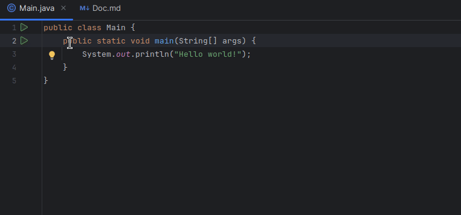

# Highlighted : an IntelliJ plugin

This is a proof-of-concept for a plugin that would allow to highlight text in editors.
Highlights are not persisted, so they disappear when the editor tab is closed.

I think this feature can be somewhat useful when teaching, mob programming, reviewing pull requests, or just when you want to keep track of some information when reading or debugging code.

Features I'd like to add :
- Setup plugin CI & distribution on the plugin store
- Be able to highlight in multiple (two or three max) colors
- Choose the colors in a Preferences screen (with support for dark/bright themes)
- That's it ? (No feature bloat!)

Note: this is my first attempt at developing an IntelliJ plugin, so expect it to be coded like a baboon.
Any help appreciated !